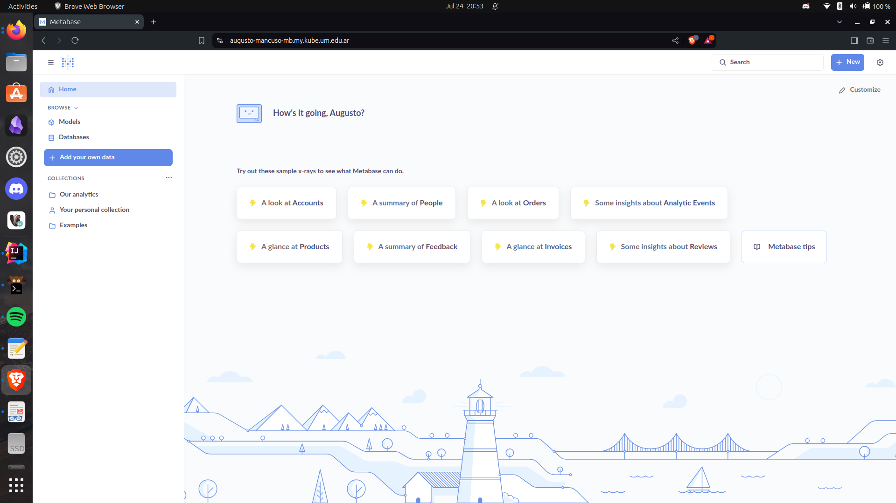
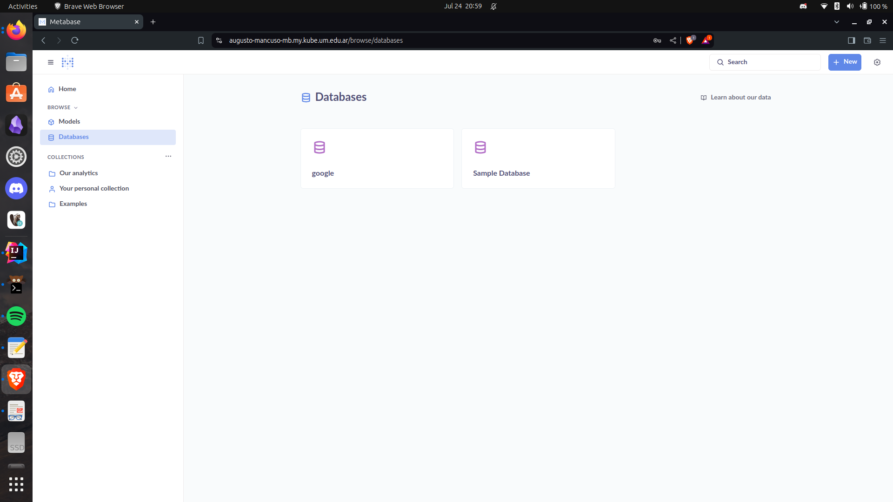
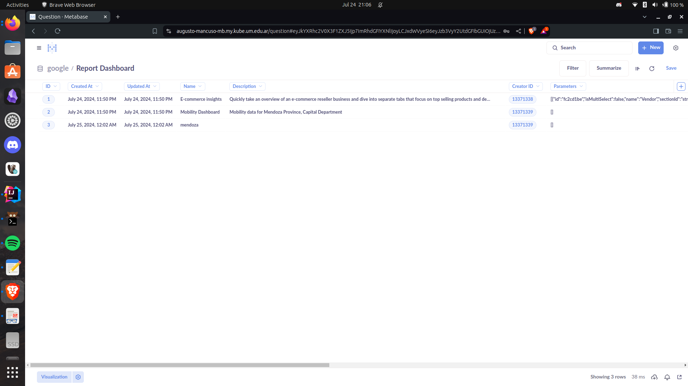

# Despliegue de Metabase en Kubernetes para Análisis de Datos de Movilidad

Este repositorio contiene los manifiestos de Kubernetes para desplegar Metabase con una base de datos MySQL. Este despliegue está específicamente diseñado para el análisis de datos de movilidad para la Provincia de Mendoza, Departamento Capital.

## Componentes

1. **Base de Datos MySQL**
    - Desplegada como un StatefulSet para garantizar la persistencia y la estabilidad.
    - Utiliza ConfigMaps para la configuración e inicialización de la base de datos.
    - Emplea un PersistentVolumeClaim para asegurar la persistencia de los datos.
    - Incluye un Job para la carga inicial de datos y la configuración de la base de datos.

2. **Metabase**
    - Desplegado como un Deployment para garantizar la disponibilidad y la escalabilidad.
    - Configurado para conectarse a la base de datos MySQL.
    - Incluye chequeos de salud y sondas de disponibilidad para asegurar un funcionamiento óptimo.
    - Incorpora un Job para la configuración inicial y la creación del dashboard.

3. **Ingress**
    - Configurado para permitir el acceso externo a Metabase.
    - Asegúrate de modificar el archivo `ingress.yaml` con el nombre de dominio que deseas utilizar.

4. **Secrets**
    - Utilizados para almacenar información sensible como contraseñas y credenciales de manera segura.

## Requisitos Previos

- Un clúster de Kubernetes en funcionamiento.
- kubectl instalado y configurado para interactuar con tu clúster.
- Un controlador de Ingress instalado en el clúster (por ejemplo, NGINX Ingress).

## Ejecución

1. Modifica el Ingress en el archivo `deployment/ingress.yml` con el nombre de dominio que deseas utilizar.

2. Aplica los manifiestos de Kubernetes con el siguiente comando:
```bash
kubectl apply -f deployment/
```

Esto creará todos los componentes necesarios en tu clúster de Kubernetes y pondrá en marcha tu instancia de Metabase para el análisis de datos de movilidad.


## Ejecución

Al ingresar a la  [url del proyecto](https://augusto-mancuso-mb.my.kube.um.edu.ar/) por primera, luego iniciar sesión, vez veremos la siguiente pantalla

Luego podremos realizar la conexión a la base de datos y realizar las preguntas.


